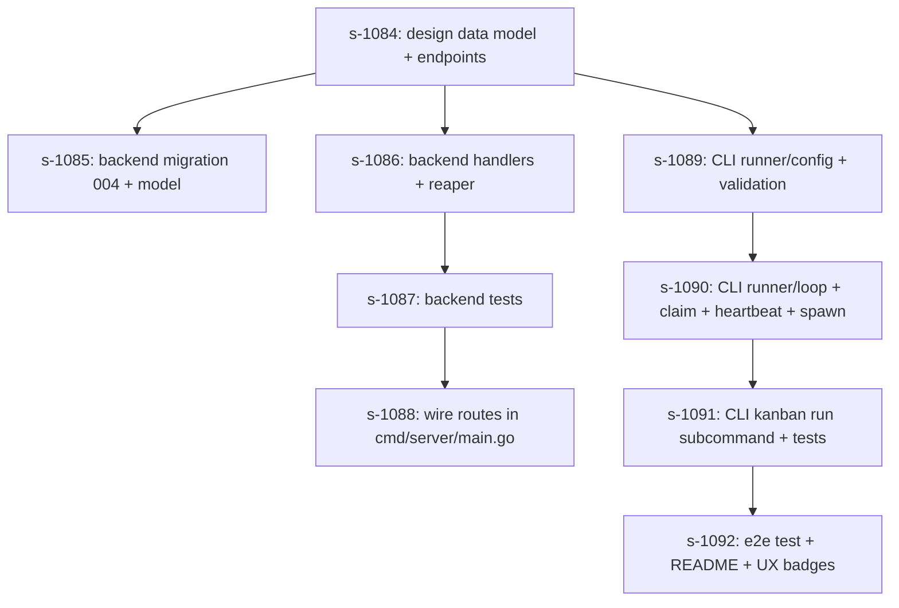

# CLI Runner Loop — Feature Plan

> Created: 2026-09-12
> Task: `s-1082`
> Parent context: `s-1061` (CLI project), `s-1060` (Runner CLI research)
> Sub-tasks created in `s-1083`: `s-1084` … `s-1092`
> Status: Plan approved — sub-tasks created and awaiting execution

---

## 1. Background & Goal

Today the Open Kanban project has two complementary surfaces:

- **Backend (Go)** — owns the data model (boards / columns / tasks), exposes
  REST + WebSocket APIs, and already supports a per-task
  `agent_id` / `agent_prompt` pair (`models.Task.AgentID`, `AgentPrompt`).
- **CLI (`open-kanban-cli`, TypeScript)** — a 1:1 mirror of the MCP tools,
  with no autonomous workflow of its own.

What is missing is the **runner loop**: a long-lived process that watches a
board / column, picks up tasks whose column advertises the runner's agent
type, hands each task's `agentPrompt` to an external agent binary
(`opencode`, `claude`, `cursor`, …), and reports the outcome back to the
kanban.

The goal of this plan is to design that loop end-to-end, then split the
work into a small number of shippable sub-tasks.

### 1.1 Functional requirements

| # | Requirement | Source |
|---|-------------|--------|
| F1 | A runner reads its project-local config (board, column status, agent binary, env) | task description |
| F2 | The runner knows the board description and the column description before claiming work | task description |
| F3 | The runner picks one task at a time and reads its `agentPrompt` | task description |
| F4 | Concurrent runners must not pick up the same task — see §3 | task description |
| F5 | Runners fail gracefully when their process crashes mid-task — see §3 | task description |
| F6 | Two invocation modes: `--board/--status` (board-bound) and `--mine` (identity-bound, cross-board) | task description |
| F7 | The runner advances tasks through the kanban lifecycle on success (move to next column, add a completion comment) | implied |
| F8 | Failures must surface as a comment + leave the task in `in_progress` so a human can re-route it | implied |

### 1.2 Non-goals (for this plan)

- Replacing the existing web UI; the runner is a *new* workflow, not a
  replacement.
- Building a generic scheduler / cron. The runner only watches one column
  (or "my tasks") and reacts to the kanban as the source of truth.
- Implementing the agent itself; the runner just shells out to an
  existing binary.

---

## 2. Configuration Format

### 2.1 Location & discovery

The runner looks for a config file, walking up from the current working
directory until it finds one. The first hit wins; no further walking.

| Filename (in priority order) | Scope |
|------------------------------|-------|
| `.kanban-runner.local.yaml`  | machine-local override (gitignored) |
| `.kanban-runner.yaml`        | project-shared config (checked into the repo) |
| `~/.config/kanban-cli/runner.json` (per-cwd-hash) | global fallback |

Rationale: the *project* knows which board/column its work lives in and
which agent type should pick up those tasks. The *machine* knows the
absolute binary path and the API URL. Two-file split mirrors the well-
established `settings.json` + `settings.local.json` pattern.

### 2.2 Schema (YAML, versioned)

```yaml
# .kanban-runner.yaml — checked into the repo
version: 1

apiUrl: http://localhost:8080        # optional; falls back to CLI config
profile: opencoder                    # optional; CLI credential profile

boardId: sys                           # F6 mode-1: required for board-bound runs
status: todo                           # column.status to watch (todo|in_progress|…)
# mode: mine                          # F6 mode-2: alternative to boardId/status

agent:
  bin: opencode                        # binary name (resolved via PATH or binPath)
  binPath: /usr/local/bin/opencode     # optional absolute path; overrides PATH lookup
  promptMode: arg                      # arg | stdin | file (how to deliver the prompt)
  promptArg: --prompt                  # used when promptMode=arg
  cwd: .                               # working dir when spawning the agent
  args:                                # extra args appended after the prompt
    - --non-interactive
  env:                                 # extra env vars (merged into process.env)
    KANBAN_API_URL: http://localhost:8080
    LOG_LEVEL: info
  timeoutMs: 1800000                   # hard ceiling per task (default 30 min)

runner:
  runnerId: ""                         # optional; default = hostname + pid + uuid
  pollIntervalMs: 5000                 # idle poll cadence
  heartbeatIntervalMs: 30000           # in-flight heartbeat cadence
  lockTimeoutMs: 120000                # server-side expiry of an orphan lock
  maxConcurrent: 1                     # 1 today; future-proof for swarm runners
  mode: claim                          # claim | move (server-side vs column-status)
```

Local overrides (`.kanban-runner.local.yaml`) accept the same schema;
scalar fields are deep-merged. Arrays (`args`, `env`) are replaced, not
concatenated, to keep behaviour deterministic.

---

## 3. Concurrency Control

### 3.1 The two options in the task description

| | Option A — "move status" | Option B — "server-managed claim + heartbeat" |
|---|---|---|
| Where is the lock? | The task's own `column_id` | A new `task_runs` row |
| How is it acquired? | `PUT /tasks/:id` with `columnId=in_progress` | `POST /tasks/:id/claim` (transactional) |
| How is it released on success? | `POST /tasks/:id/complete` | `POST /tasks/:id/release` + lifecycle call |
| How is it released on failure? | Best-effort move back to `todo` (racy) | `POST /tasks/:id/release` (or reaper) |
| How is a crashed runner recovered? | Stale `in_progress` rows accumulate; humans clean up | A background reaper expires rows past `lockTimeoutMs` |
| Server complexity | None — uses existing column status | New table + 3 endpoints + reaper |

### 3.2 Decision

**Option B (server-managed claim + heartbeat) is the right primitive.**
Reasons:

1. Crashes are silent in option A. A `todo → in_progress` move looks
   identical to a `todo → in_progress` *claim*; once the runner dies,
   the task is stuck and only a human can recover it.
2. Option B is the only way to implement *Mode 2* (`--mine`) cleanly:
   a runner may legitimately pick from columns it doesn't own, and
   `column.status` cannot express that.
3. We still get a UX win: with claim/heartbeat, the web UI can show
   "claimed by `runner-opencoder-7f3a` 12s ago" inline, which is
   impossible with option A.

We will **keep option A's spirit** by also exposing
`POST /tasks/:id/start-run` (move to `in_progress` when a claim is
acquired). That keeps the existing column semantics for human viewers
unchanged — they still see the same four-column flow.

### 3.3 Server-side data model

Add migration `004_task_runs.sql` (sqlite + mysql). New table:

```sql
CREATE TABLE IF NOT EXISTS task_runs (
    task_id            TEXT PRIMARY KEY,
    runner_id          TEXT NOT NULL,
    agent_id           TEXT NOT NULL,         -- tokens.user_agent of the CLI
    board_id           TEXT NOT NULL,
    column_id          TEXT NOT NULL,         -- snapshot at claim time
    status             TEXT NOT NULL,         -- 'claimed' | 'running' | 'completed' | 'failed' | 'released'
    claimed_at         DATETIME NOT NULL,
    last_heartbeat_at  DATETIME NOT NULL,
    expires_at         DATETIME NOT NULL,     -- last_heartbeat_at + lockTimeoutMs
    finished_at        DATETIME,
    exit_code          INTEGER,
    error              TEXT,
    FOREIGN KEY (task_id) REFERENCES tasks(id) ON DELETE CASCADE,
    FOREIGN KEY (runner_id) REFERENCES users(id) ON DELETE SET NULL
);
CREATE INDEX IF NOT EXISTS idx_task_runs_expires  ON task_runs(expires_at);
CREATE INDEX IF NOT EXISTS idx_task_runs_runner   ON task_runs(runner_id);
CREATE INDEX IF NOT EXISTS idx_task_runs_status   ON task_runs(status);
```

### 3.4 New endpoints

All endpoints live under `/api/v1/runs/*` and require
`RequireAuth(db)` middleware.

| Method + Path | Body | Behaviour |
|---------------|------|-----------|
| `POST /api/v1/runs/claim` | `{ boardId, status, agentType, runnerId }` | Atomic: in one transaction, find a task whose column matches `(boardId, status)`, whose column's `agent_types` contains `agentType`, that is **not** already claimed (or whose `task_runs.expires_at < now`), insert `task_runs` row, move the task to the column with `status='in_progress'`, return the full task JSON (including `agentPrompt`). Returns `204 No Content` if no eligible task exists. |
| `POST /api/v1/runs/:taskId/heartbeat` | `{ runnerId }` | Refresh `last_heartbeat_at = now` and `expires_at = now + lockTimeoutMs` if the row matches `(runner_id, status IN ('claimed','running'))`. Returns `200` with the new `expires_at`. Returns `409` if the lock has been reaped. |
| `POST /api/v1/runs/:taskId/finish` | `{ runnerId, status: 'completed' \| 'failed', exitCode?, error? }` | Marks the run row as `completed`/`failed`, deletes the row, and — when `status='completed'` — calls the existing `task_service.CompleteTask` so the task advances to the next column. On `failed`, the task stays in `in_progress`; the runner is expected to have already added a failure comment. |
| `POST /api/v1/runs/release` | `{ runnerId, taskIds?: string[] }` | Bulk release all runs owned by `runnerId`. Used on graceful shutdown and as a startup cleanup. |
| `GET  /api/v1/runs/:taskId` | — | Returns the current run row (used by the web UI to show "claimed by X 12s ago"). |

### 3.5 Reaper

A background goroutine on the server wakes every 30s and:

```sql
UPDATE task_runs
SET    status = 'released', finished_at = NOW(), error = 'lock expired'
WHERE  status IN ('claimed', 'running')
  AND  expires_at < NOW();

-- For each released row above, also restore the task to its column's
-- original status. We snapshot column_id+board_id on claim, so the
-- rollback is a single UPDATE tasks JOIN.
UPDATE tasks SET column_id = (
    SELECT original_column_id FROM task_runs WHERE task_id = tasks.id
) WHERE id IN (...);
```

The reaper runs inside the existing `services` package, registered at
`server/main.go` boot.

---

## 4. CLI Architecture

### 4.1 New files

```
cli/src/runner/
├── config.ts          # load + deep-merge .kanban-runner{,.local}.yaml
├── loop.ts            # the run loop
├── claim.ts           # HTTP client for /api/v1/runs/*
├── prompt.ts          # compose the agent prompt (board/column/task)
├── spawn.ts           # child_process wrapper + signal handling
├── heartbeat.ts       # interval-based heartbeat
└── types.ts

cli/src/commands/
└── run.ts             # `kanban run` subcommand (--config / --board/--status / --mine)
cli/tests/
└── runner/
    ├── config.test.ts
    ├── loop.test.ts
    ├── claim.test.ts
    └── prompt.test.ts
```

### 4.2 Run loop algorithm

```
init:
  cfg = loadConfig(cwd)                # walks up to find .kanban-runner.yaml
  validate(cfg)                        # board/status OR mode=mine; agent.bin required
  runnerId = cfg.runner.runnerId ?? `${hostname()}-${pid()}-${uuid()}`
  http    = new HttpClient({ apiUrl: cfg.apiUrl ?? resolved.apiUrl, profile: cfg.profile })
  boardDesc, colDesc = fetchContext(http, cfg.boardId, cfg.status)
  promptTemplate = renderPromptTemplate(boardDesc, colDesc)

state: { inFlight?: { taskId, child, deadline } }

loop forever:
  if inFlight:
    if now >= heartbeatDeadline: POST /runs/:taskId/heartbeat; reset deadline
    if child exited:
      exit = child.exitCode
      if exit == 0:
        await POST /runs/:taskId/finish { status: 'completed', exitCode: 0 }
      else:
        await POST /runs/:taskId/finish { status: 'failed', exitCode, error: stderr }
      inFlight = undefined
    continue
  else:
    res = await POST /runs/claim { boardId, status, agentType, runnerId }
    if res.status == 204:
      await sleep(cfg.runner.pollIntervalMs)
      continue
    task = res.body
    prompt = renderPrompt(promptTemplate, task)
    child = spawnAgent(cfg.agent, prompt, task.id)
    inFlight = { taskId: task.id, child, deadline: now + cfg.runner.heartbeatIntervalMs }

on SIGINT/SIGTERM:
  if inFlight:
    child.kill('SIGTERM')
    await child.wait(15s)             # graceful
    await POST /runs/:taskId/finish { status: 'failed', error: 'runner shutdown' }
  await POST /runs/release { runnerId }   # releases any orphan claims
  exit 0
```

### 4.3 Mode 2 — `--mine`

When `mode: mine` is set (or `--mine` is passed), the runner uses a
slightly different claim request:

```jsonc
POST /api/v1/runs/claim
{
  "boardId":   "*",                   // server ignores when mode=mine
  "status":    "*",                   // server ignores when mode=mine
  "agentType": "<tokens.user_agent>",
  "mode":      "mine",                // server uses /api/v1/mcp/my-tasks logic
  "runnerId":  "..."
}
```

Server-side, this delegates to the existing
`GetMyTasks` filter pipeline (see `handlers/tasks_mytasks.go:39-66`)
to pick the eligible task. The claim semantics are otherwise identical.

### 4.4 Agent prompt assembly

```ts
function renderPrompt(tpl: string, task: Task, ctx: { board: Board, column: Column }): string {
  return [
    `# Board: ${ctx.board.name}`,
    ctx.board.description || '(no description)',
    '',
    `# Column: ${ctx.column.name}`,
    ctx.column.description || '(no description)',
    '',
    `# Task ${task.id}`,
    `Title: ${task.title}`,
    `Priority: ${task.priority}`,
    `Assignee: ${task.assignee ?? 'unassigned'}`,
    task.description ? `\n${task.description}\n` : '',
    '## Agent Prompt',
    task.agentPrompt ?? '(none provided)',
    '## Meta',
    task.meta ?? '{}',
    '## Comments',
    ...task.comments.map(c => `- ${c.author}: ${c.content}`),
    '## Subtasks',
    ...task.subtasks.map(s => `- [${s.completed ? 'x' : ' '}] ${s.title}`),
  ].join('\n');
}
```

Delivery to the agent:

- `promptMode=arg`: argv becomes `<agent.bin> <agent.args> --prompt <stdinFile>`.
  The CLI writes the prompt to a temp file under `os.tmpdir()` and passes
  the path; this avoids argv length limits and quoting pitfalls.
- `promptMode=stdin`: prompt is piped to the child's stdin.
- `promptMode=file`: prompt is written to `<cwd>/.kanban-runner-<taskId>.md`
  and the path is passed via `--prompt-file`.

### 4.5 Failure reporting

When the agent exits non-zero (or is killed by timeout), the runner:

1. Captures up to 64 KiB of stderr.
2. Calls `POST /runs/:taskId/finish { status: 'failed', exitCode, error }`.
3. Adds a comment via `POST /api/v1/comments` with the error excerpt so a
   human reviewer can see *why* it failed without leaving the kanban.
4. Leaves the task in `in_progress` (per F8).

### 4.6 Config validation

Strict, fail-fast on startup. Errors must be actionable:

- `boardId + status` XOR `mode: mine` (not both, not neither).
- `agent.bin` is required and must be either an absolute path that
  exists or a name resolvable via `PATH`.
- `runner.lockTimeoutMs > runner.heartbeatIntervalMs * 2`.
- If `mode: mine`, the CLI profile must be logged in (the server needs
  `tokens.user_agent`).

---

## 5. UI Touchpoints

Minimal — the kanban already shows the column flow. New additions:

| Surface | Change |
|---------|--------|
| Task card (board page) | A small badge "🤖 opencoder · 12s" appears when a `task_runs` row is `claimed/running`. The badge is rendered by a new `/api/v1/runs/:taskId` lookup that the existing task card already polls. |
| Settings → Tokens | Show the `user_agent` of each token (already exists; just expose it in the existing token list). |
| Run history | Optional — a new `GET /api/v1/runs?runnerId=…&status=failed` endpoint feeds a small page listing recent failures. *Defer to a follow-up task.* |

---

## 6. Testing Strategy

### 6.1 Backend

Per CLAUDE.md conventions, all new handlers ship with `*_test.go`:

| File | Coverage |
|------|----------|
| `handlers/tasks_run_test.go` | claim (success / no-eligible / already-claimed), heartbeat (refresh / 409 after reaper), finish (completed / failed), release, GET single, atomicity (two parallel claims only win once), permission checks (non-WRITE gets 403), reaper (expired row → released). |
| `services/run_reaper_test.go` | Reaper sweeps stale rows, restores task column, idempotency. |
| `migrations_test.go` (extend) | Migration 004 applies cleanly on sqlite + mysql. |

Test scaffold follows the existing `handlers/columns_test.go` pattern:
in-memory SQLite with all tables + foreign keys, seed a board + column
+ tokens, drive handlers via `httptest`.

### 6.2 CLI

Vitest, mirroring existing tests:

- `runner/config.test.ts` — discovery walk-up, deep-merge precedence,
  validation errors.
- `runner/claim.test.ts` — mocks fetch to verify happy path, 204 path,
  409 path.
- `runner/loop.test.ts` — uses fake timers + a mocked child process to
  exercise: idle → claim → spawn → heartbeat → exit-success →
  finish → claim next; exit-failure → comment + finish; SIGTERM →
  graceful drain.
- `runner/prompt.test.ts` — deterministic snapshot of the rendered
  prompt for a sample task.

### 6.3 End-to-end

A new `tests/e2e/runner.test.ts` spins up the Go server in `:memory:`,
writes a `.kanban-runner.yaml` pointing at it, mocks the agent binary
with a node script that exits 0, runs `kanban run --config …` for 5s,
and asserts:

1. The task moved from `todo` → `review` (via `complete`).
2. A `POST /runs/:taskId/finish { status: 'completed' }` was recorded.
3. The second task was not started (because there was only one).

---

## 7. Execution Plan

The work is split into nine sub-tasks. Each sub-task is independently
shippable, but the dependency arrows reflect the order they should be
picked up.



| ID | Title | Effort | Owner-area |
|----|-------|--------|------------|
| s-1084 | **Design review** of the data model + endpoints in this doc; produce the final OpenAPI snippet | 0.5 d | backend lead |
| s-1085 | Migration `004_task_runs.{up,down}.sql` for sqlite + mysql, bump `version_map.go`, add `models.TaskRun` | 0.5 d | backend |
| s-1086 | `handlers/tasks_run.go` (claim/heartbeat/finish/release/get), `services/run_reaper.go`, register reaper at boot | 2 d | backend |
| s-1087 | `handlers/tasks_run_test.go` + `services/run_reaper_test.go`, including two-parallel-claim race test | 1.5 d | backend |
| s-1088 | Wire `/api/v1/runs/*` routes in `cmd/server/main.go` (already gated by `RequireAuth`); extend `permission_helper.go` so claims require column WRITE | 0.5 d | backend |
| s-1089 | `cli/src/runner/config.ts` (discovery, deep-merge, validation) + `runner/config.test.ts` | 1 d | CLI |
| s-1090 | `cli/src/runner/{claim,heartbeat,spawn,prompt,loop}.ts` + unit tests | 2.5 d | CLI |
| s-1091 | `cli/src/commands/run.ts` — `kanban run [--config FILE] [--board ID --status S | --mine] [--once]`; vitest suite; man page entry | 1 d | CLI |
| s-1092 | e2e test (`tests/e2e/runner.test.ts`), `cli/README.md` "Runner" section, kanban UI badge for in-flight run, follow-up ticket for run-history page | 1.5 d | both |

Total: ~11 working days for one engineer; ~6 days if backend and CLI
work in parallel after s-1084.

---

## 8. Risks & Mitigations

| Risk | Likelihood | Impact | Mitigation |
|------|-----------|--------|------------|
| Reaper releases a *legitimately* long-running task because the agent binary hangs without flushing stdout | M | H | Heartbeat also fires on partial progress: the agent process must write a heartbeat file (or env-driven hook) that the runner watches; missing for > 2× heartbeatIntervalMs triggers a SIGTERM. *Documented in `agent.timeoutMs` semantics.* |
| Two runners both win a claim because of a TOCTOU bug in the SELECT-then-INSERT | L | H | Single `INSERT … ON CONFLICT DO NOTHING RETURNING …` (sqlite) / `INSERT … ON DUPLICATE KEY UPDATE …` (mysql) wrapped in the claim transaction; covered by the parallel-claim test in s-1104. |
| `--mine` mode silently picks a task that a human is mid-editing | M | M | The runner always moves the task to `in_progress` on claim; the existing web UI shows the column move and WebSocket pushes the update within ~200ms. |
| `.kanban-runner.local.yaml` accidentally committed | M | M | Add `.kanban-runner.local.yaml` to the project `.gitignore` in the same PR; document in README. |
| Long prompts blow past argv limits on Windows | L | L | Default `promptMode=arg` already routes through a temp file (see §4.4). |
| Agent binary is destructive (e.g. `rm -rf` in its prompt) | M | H | The runner does **not** execute the prompt; the agent does. Document that prompts must be trusted. Out of scope to sandbox here. |

---

## 9. Open Questions

1. **Auth scoping for the runner** — Should the claim endpoint require
   `column WRITE`, or accept any authenticated user? Current plan:
   `WRITE` (matches "you can already create tasks here"). Confirm with
   the PM.
2. **Heartbeat hook in the agent** — Do we expect every supported agent
   (`opencode`, `claude`, `cursor`) to emit heartbeats, or should the
   runner rely solely on the child process being alive? Current plan:
   process-alive only, with a hard `agent.timeoutMs` ceiling. Confirm
   once we know what real agents look like.
3. **Run-history UI** — Defer to a follow-up? Or part of v1? Current plan:
   defer (s-1109 leaves a follow-up ticket stub).

---

## 10. Definition of Done

- [ ] All sub-tasks s-1084 … s-1092 merged to `main`.
- [ ] `go test ./...` green.
- [ ] `npm test` in `cli/` green.
- [ ] `npm run build` produces a working `dist/index.js` with
      `kanban run --help` and a man page.
- [ ] e2e test green in CI.
- [ ] `cli/README.md` updated with a "Runner" section.
- [ ] A short demo recorded: one terminal shows the runner, one shows
      the kanban UI updating live.
- [ ] Migration `004` applied to the demo instance without downtime.

---

## 11. References

- Task description: `s-1082` (this document's parent).
- CLI plan: `devDoc/CLI_PROJECT_PLAN_2026-09-12.md`.
- Existing data model: `backend/internal/models/models.go:44-91`.
- Existing claim-style code: `backend/internal/handlers/tasks_mytasks.go:39-66`.
- Existing column agent config: `backend/internal/handlers/columns.go:492-642`.
- Existing schema migrations: `backend/internal/database/migrations/`.
